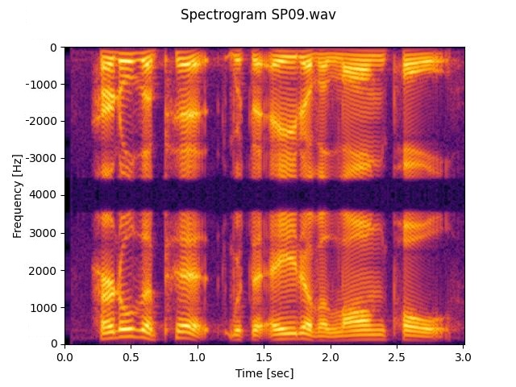

# Short-Time Fourier Transform (STFT)

This module implements Forward and inverse Short-Time Fourier Transform (STFT) in Python using MLX.

It is designed to inherit from the nn.Module, which allows it to be used either as a standalone module or as part of a larger neural network architecture. 

## Installation
You can install mlx_stft directly from pypi:
```bash
pip install mlx_stft
```

Or you can install it directly from the source code:
```bash
git clone https://github.com/nuniz/mlx_stft.git
cd mlx_stft
python setup.py install
```

## Features

- **Multiple Backends**: FFT-based or convolution-based implementations
- **JIT Compilation**: Compiled versions (`CompiledSTFT`, `CompiledISTFT`)
- **Spectrum Modes**: Support for both one-sided and dual-sided spectrums

## Usage
```python
from mlx_stft import STFT, ISTFT

# Forward transform
stft = STFT(n_fft=1024, hop_length=256, onesided=True)
spectrum = stft(x)

# Inverse transform
istft = ISTFT(n_fft=1024, hop_length=256, onesided=True)
reconstructed = istft(spectrum, length=x.shape[-1])
```

### Compiled (JIT) Versions
```python
from mlx_stft import CompiledSTFT, CompiledISTFT

# Use compiled versions for better performance
stft = CompiledSTFT(n_fft=1024, hop_length=256, onesided=True)
istft = CompiledISTFT(n_fft=1024, hop_length=256, onesided=True)
```

## Arguments

### STFT
    n_fft: Number of Fourier transform points.
    win_length: Length of the STFT window (default: same as n_fft).
    hop_length: Number of audio samples between adjacent STFT columns.
    window: Type of window function to apply (default is "hann").
    onesided: Whether to return only the non-redundant part of the spectrum (default is False).
    return_db: Whether to return the result in decibels (default is False).
    use_fft: Force FFT-based computation. If None, auto-selects based on n_fft

### ISTFT
    n_fft: Number of Fourier transform points.
    win_length: Length of the STFT window (default: same as n_fft).
    hop_length: Number of audio samples between adjacent STFT columns.
    window: Type of window function to apply (default is "hann").
    onesided: Whether the input spectrum is one-sided (default is False).
    use_fft: Force FFT-based computation. If None, auto-selects based on n_fft.
    center: Whether to center the frames (default is True).

## Performance

Benchmarks on Apple M4 (16GB RAM) with n_fft=1024, signal_length=16000, batch_size=1:

| Transform | Compiled | Onesided | Time (ms) | Throughput |
|-----------|----------|----------|-----------|------------|
| STFT | No | Yes | 0.64 ± 0.07 | 25.0 M samples/s |
| STFT | Yes | Yes | 0.44 ± 0.03 | 36.6 M samples/s |
| iSTFT | No | Yes | 0.86 ± 0.13 | 18.7 M samples/s |
| iSTFT | Yes | Yes | 0.82 ± 0.12 | 19.5 M samples/s |
| Roundtrip | Yes | Yes | 0.83 ± 0.07 | 19.2 M samples/s |

Run your benchmarks:
```bash
python scripts/benchmark.py --quick  # Quick benchmark
python scripts/benchmark.py          # Full benchmark with multiple configurations
```

## Example

The STFT is illustrated in the picture below using the [NOIZEUS](https://ecs.utdallas.edu/loizou/speech/noizeus/) dataset's sp09.wav file.

### One-Sided STFT


### Dual-Sided STFT


